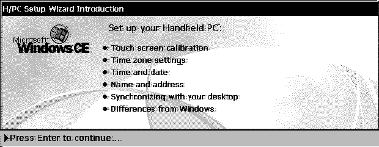
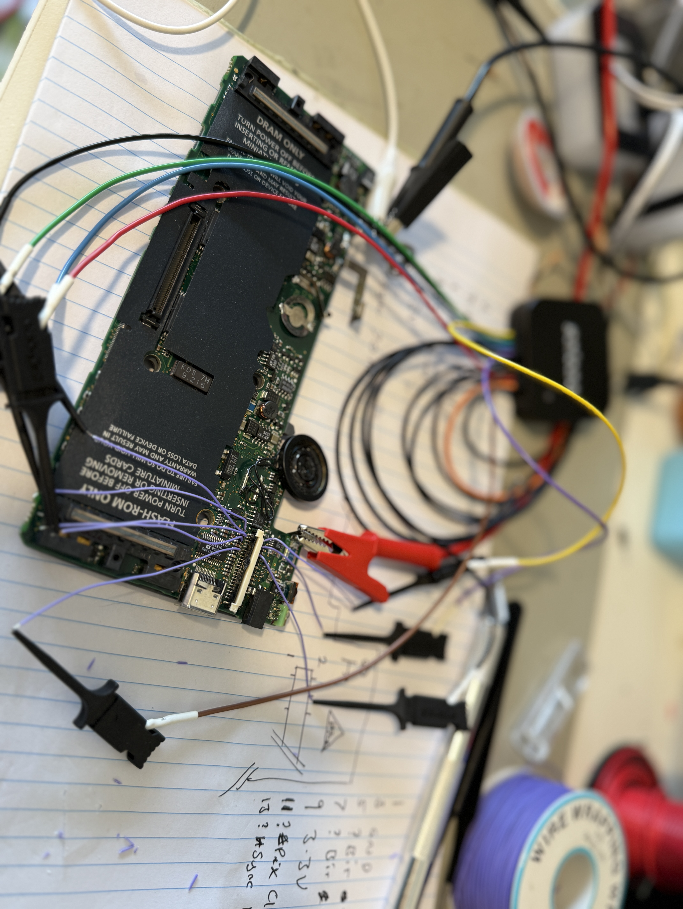

# Philips Velo 500 Display
This project aims to decode the display module for the Philips Velo 500 handheld PC from 1997.

## Projects
There are two half baked projects contained here:
* Python Decoder - A python script to decode the raw data collected by the Saleae logic analyser.
* Tang Nano Decoder - Verilog code written in Gowin IDE for the Tang Nano 9K FPGA to decode the data in real-time.
  

## Display
The display is 620 x 240 pixels monochrome using PWM / temporal dithering to display 16 grayscales. Data is transmitted across a 4-bit data bus with each bit corresponding to adjacent pixels (that is bit 0 = pixel 0, bit 1 = pixel 1 ... bit 0 = pixel 4, bit 1 = pixel 5, ...). Frames are then modified over what appears to be a 4-frame cycle to adjust the pixel intensity. Otherwise the display uses familiar HSYNC, VSYNC, and Dot Clock signals with 10 cycle back and front porch.

## Pinout
The display module contains a 620 x 240 LCD, touch panel, and RJ11 modem jack. The whole module connects to the main board with a 40-pin 0.5mm pitch, single sided FPC. The table below is arranged as the pins are on the board (both sides of the connector), even though the connector itself is only single sided. I'm not sure about this bit order, I've tried to note it down twice and got different results. More trial and error required.

| Pin | Function | Function | Pin |
|:---------:|:------------:|:---------:|:------------:|
| 1 | GND | LCD Data 0 | 2 |
| 3 | LCD Data 3 | GND | 4 |
| 5 | LCD Data 2 | LCD Data 1 | 6 |
| 7 | 3V3 | 3V3 | 8 |
| 9 | LCD Pixel Clock (~4.6MHz) |  | 10 |
| 11 | LCD HSYNC (~17KHz) | LCD VSYNC (70Hz) | 12 |
| 13 |  |  | 14 |
| 15 |  |  | 16 |
| 17 |  |  | 18 |
| 19 |  | ? Touch Int / EN | 20 |
| 21 | GND | 17KHz Pulses | 22 |
| 23 |  |  | 24 |
| 25 | ? Touch Data |  | 26 |
| 27 | ? Touch Data Clock (9.15MHz) |  | 28 |
| 29 | ? Touch Data | ? Touch Line Sync Pulse (128 clocks per pulse, 122 pulses per burst) | 30 |
| 31 | 3V3 | 3V3 | 32 |
| 33 |  |  | 34 |

## Touch Panel
Work in Progress - There are some capture files of the touch panel data but I have not decoded it yet. Please feel free to contribute.